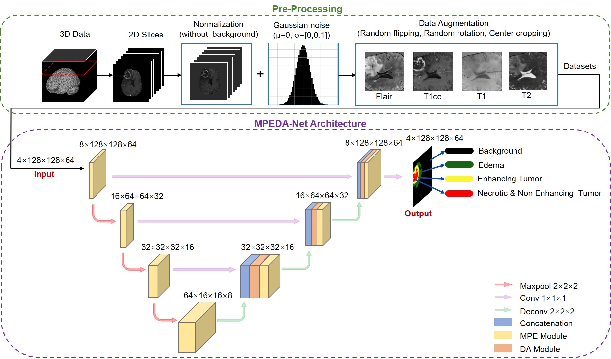

:rabbit: :If you want to the 'model.pth', Please connect me by 1091627587@qq.com or lyhyun318925@gmail.com.


:point_down: :point_down: :point_down:

# MPEDANet-pytorch
  Firstly, you should into TempCode.
  - **code_pytorch**: all code in here
  - **dataset**: put the dataset

# Model structure


# How to start quickly.
  ```bash
  python train.py
```

the train.py has some arg, you can find the detail in the file.
