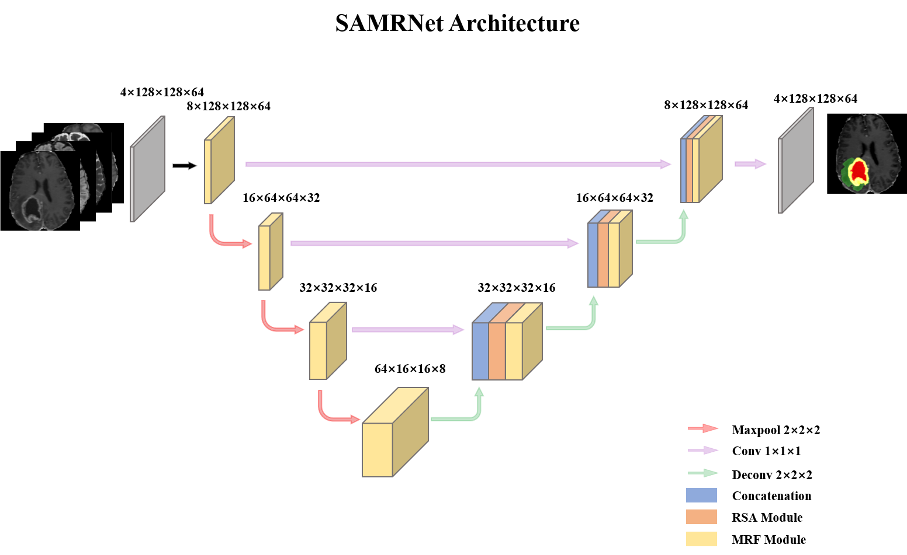

# SAMRNet-pytorch
  we all code in the code_pytorch folder.

# Model structure


# How to start quickly.
  ```bash
  python train.py
```

  
 the train.py has some arg, you can find the detail in the file.
